<p align="center">
 
</p>

Angular Unit Testing with Jasmine and Karma
=====================

Welcome
---------------------

About the Course/Tutorial
---------------------

Hi All, I'm **`Dinanath Jayaswal, Senior UI/Web Developer and Adobe Certified Expert Professional`**, I wanna welcome you to `Angular Unit Testing with Jasmine and Karma`. In this course/tutorial, will take you from the basics/ground and gives you a solid foundation to write automated tests for your Angular apps. Whether you're an absolute beginner or have some familiarity with automated testing, this course/tutorial will give you all the necessary building block skills to write automated tests for your Angular apps. 

Let us dive into a topic which lots of developers/technical professionals are struggling and afraid of - `Testing our code`. In this section, we will learn how to write an automated test for Angular Applications. 


Who is this for? 
---------------------

This Course/Tutorial is ideal for:
- Freshers and aspiring UI (JavaScript/Angular) developers
- Absolute beginner Angular developers (Front-End developer)
- Experienced Technical developers
- Developers upgrading from AngularJS 1.x to Angular 2 or above
- Full Stack Developers
- Technical/Team Leads
- Architects, Technical Project Managers, QAs

This course/Tutorial is for anyone and everyone, Almost everyone! Fresher/Newcomer as well as experienced UI/frontend/Web Developers who are interested in boost skills and further career in Angular world - by learning new latest dynamic tools/utilities which helps to Test Angular application code to become a hi-tech developer.

Why learn Angular Unit Testing with Jasmine & Karma
---------------------
- Writing Unit/Integration Test cases and testing code is an art, it helps to produce a product with fewer bugs and better quality
- Tests are the best way to prevent software defects
- In the long run for large applications, manual testing ends up with extreme pain and time-consuming. With automated testing, you spend less time fixing bugs and testing code
- Automated testing is a practice that has been adopted by various organizations and a lot of successful software development teams so Unit Testing becomes a popular skill to learn, know and use

Course/Tutorial achievement
---------------------

Course/Tutorial Goal
---------------------

After completing/attending this Course/Tutorial, participants should be able to: 
1. Write Unit and Integration test cases for Angular application using Jasmine
2. Write clean and maintainable tests for your Angular apps
2. Feel comfortable writing Angular tests for testing Functions, Logics, Events, multiple types of Components, Attributes-Directives, Dependencies, Routers- Navigation, and services
3. Know and get familiar with Angular testing best practices

Prerequisites for current course / What you need to know
---------------------
The primary focus for this tutorial is testing Angular Applications and code so it is must to know Angular (version 2 and above) and TypeScript. It is advisable to view course/tutorial on Angular - [Angular step by step](https://github.com/dinanathsj29/angular7-step-by-step) and Typescript [Typescript tutorial for all](https://github.com/dinanathsj29/typescript-tutorial) before dive deeper with Angular testing.

Topics included/covered
=====================

1. [Introduction to Automated testing](#1-introduction-to-automated-testing)
    - 1.1. [Common questions in mind of developers](#11-common-questions-in-mind-of-developers)
    - 1.2. [Developers thoughts](#12-developers-thoughts)
    - 1.3. [What is automated testing?](#13-what-is-automated-testing)
    - 1.4. [Is it a replacement for manual testing?](#14-is-it-a-replacement-for-manual-testing)
    - 1.5. [Codebase to develope](#15-codebase-to-develope)
    - 1.6. [Why Test?](#16-why-test)
    - 1.7. [Benefits/Advantages of Automated Testing](#17-benefits-advantages-of-automated-testing)
    - 1.8. [Do I need Automated testing?](#18-do-i-need-automated-testing)
    - 1.9. [First code or write the test? TDD BDD](#19-first-code-or-write-the-test-tdd-bdd)
    - 1.10. [What to test?](#110-what-to-test)

2. [Different types of tests](#2-different-types-of-tests)
    - 2.1. [Unit Test](#21-unit-test)
    - 2.2. [Integration Test](#22-integration-test)
    - 2.3. [End-to-End or End-2-End or E2E Test or Functional Testing](#23-end-to-end-test)
    - 2.4. [The testing pyramid](#24-the-testing-pyramid)
 
3. [The Angular Testing Tools-Toolchain](#3-the-angular-testing-tools-toolchain)
    - 3.1. [Testing Tool categories](#31-testing-tool-categories)
    - 3.2. [Testing Tools](#32-testing-tools)

4. [Setup Angular test](#4-setup-angular-test)
    - 4.1. [Installing tools-utilities](#41-installing-tools-utilities)
    - 4.2. [Core package-dependencies for testing](#42-core-package-dependencies-for-testing)
    - 4.3. [Core test setting-configuration files](#43-core-test-setting-configuration-files)

5. [Fundamentals of Unit Testing](#5-fundamentals-of-unit-testing)
    - 5.1. [Clean coding principles-best practices](#51-clean-coding-principles-best-practices)
    - 5.2. [Creating a spec test file](#52-creating-a-spec-test-file)
    - 5.3. [How to write unit tests](#53-how-to-write-unit-tests)
    - 5.4. [Widely used Angular Unit Testing functions](#54-widely-used-angular-unit-testing-functions)

6. [Starting with Unit Testing](#6-starting-with-unit-testing)
    - 6.1. [Unit Testing-Functions](#61-unit-testing-functions)
    - 6.2. [Unit Testing-Parameterized Functions](#62-unit-testing-parameterized-functions)
    - 6.3. [Running a specific test case](#63-running-a-specific-test-case)
    - 6.4. [Unit Testing-Strings](#64-unit-testing-strings)
    - 6.5. [Unit Testing-Arrays](#65-unit-testing-arrays)
    - 6.6. [Set Up and Tear Down](#66-set-up-and-tear-down)
    - 6.7. [Unit Testing-Forms](#67-unit-testing-forms)
    - 6.8. [Unit Testing-Event Emitters](#68-unit-testing-event-emitters)
    - 6.9. [Unit Testing Limitations](#69-unit-testing-limitations)

7. [Code coverage](#7-code-coverage)

8. [Working with Integration Testing](#8-working-with-integration-testing)
    - 8.1. [Integration Test-Setup](#81-integration-test-setup)
    - 8.2. [Integration Test-Generating setup code](#82-integration-test-generating-setup-code)
    - 8.3. [ATB Angular TestBed](#83-atb-angular-testbed)
    - 8.4. [Integration Test-Property binding](#84-integration-test-property-binding)
    - 8.5. [Integration Test-Event binding](#85-integration-test-event-binding)
    - 8.6. [fixture detectChanges](#86-fixture-detectchanges)
    - 8.7. [Integration Test-Providing dependencies](#87-integration-test-providing-dependencies)
    - 8.8. [Testing OnInit ngOnInit](#88-testing-onInit-ngOnInit)
    - 8.9. [Why do we use NO ERRORS SCHEMA](#89-why-do-we-use-no-errors-schema)
    - 8.10. [Why do we use NO_CUSTOM_SCHEMA](#810-why-do-we-use-no-custom-schema)

9. [Angular Testing Resources](#9-angular-testing-resources)

1 Introduction to Automated testing
=====================

1.1. Common questions in mind of developers
---------------------

- What is automated testing?
- Is it a replacement for manual testing?
- Do I need Automated testing?
- Do I write Test first (TDD - Test Driven Development) or application code first?
- What to test?

1.2. Developers thoughts
---------------------

`Testing our code is an important and integral part of any project` but the majority of developer/technical professionals doesn't follow it, because:
- Testing looks complex
- Its time consuming
- Developers are not clear about Testing
- Don't know how to work with Testing
- No clear idea/picture what to test 

1.3. What is automated testing?
---------------------

> **Automated testing** 
- Testing is the process of checking the code/functionality manually or in an automated fashion
- Automated testing is `process/practice of writing code to test our code`, then run tests in an automated fashion
- Automated testing is performed by writing test cases/scripts
  - `Manual Testing` is performed by a human carefully executing the test steps
  - `Automation Testing` means using an automation tool to execute your test case suite

1.4. Is it a replacement for manual testing
---------------------
1.4. Development and Testing Life cycle
---------------------

Both Manual Testing & Automated Testing have their advantages and disadvantages: 
- For `smaller applications`, Manual Testing is beneficial at the same time 
- `Large enterprise applications` Automated Testing plays an important role 
- Some project/software application (in which requirements changes frequently, R & D Projects) Manual Testing is the best option
- Also in some project/software application combination of both Manual Testing & Automated Testing works and fit fine (`complex things checked manually and dynamic things can be automated tested`)

### Manual Testing Process Life cycle
1. **<u>Code</u>** - We Develop some code/features
2. **<u>Results</u>** - We have some expected results in mind
3. **<u>Test</u>** - We Test/check applicaton
 - If all looks good/works fine - `success confirmation` - develope other next piece code/feature
 - If any error/not happy with code - `Failure` - Modify/Fix and test again

### Automated Testing Process Life cycle
1. **<u>Code</u>** - We Develop some code/features
2. **<u>Results</u>** - We have some expected results in mind
3. **<u>Test</u>** - We can Automate and Simply Tests 
 - We can test some part manually
 - At the same time write test cases/automate some task to avoid manual and time-consuming interaction
 - `Automate testing helps to get breaking changes/last-minute code shocking changes at the initial level itself`

Whenever we develop any application we need to test it. Sometimes the test is performed manually by developer/QA team member or at a time we prefer writing an Automated Unit Test.

`Test-Driven Development is a single powerful tool to prevent bugs, defects from within our application`. By putting some efforts on Testing we get better quality software with fewer bugs which is more maintainable in the long term.

### Manual testing process/steps
1. Launch application in the browser
2. Login to application
3. Go to the target page
4. Follow proper steps and do some clicks here there to test & check, code or functionality developed
5. Test/check positive and negative both scenarios for particular functionality/function

`All the way manual testing is pretty time consuming, to follow all the steps/cycle discussed above, we may need a couple of minutes.`

- Manual Testing of all workflows, all fields, all negative scenarios is time and money consuming
- It is difficult to test for multi-lingual sites manually
- Manual Testing can become boring and hence error-prone.

### Automated testing process/steps
`We can write code, directly call the function with different positive and negative input values, and test functionality/function in a fraction of the moment.`

- Automation increases the speed of test execution
- Automation helps increase Test Coverage
- Automation does not require human intervention. You can run automated test unattended (overnight)

1.5. Codebase to develope
---------------------

With Automated testing, we have to `write Production Code as well as Unit Test Code`, so it `takes significantly more time` as compared to normal development time.

<p>
 <figure>
 &nbsp;&nbsp;&nbsp; 
 <figcaption>&nbsp;&nbsp;&nbsp; Image - Codebase to develop (Production + Test Code)</figcaption>
 </figure>
</p>

### Production/Development Cost

Its fact that implementing the feature with unit test/testing will take more time than development without unit test/testing.

<p>
 <figure>
 &nbsp;&nbsp;&nbsp; 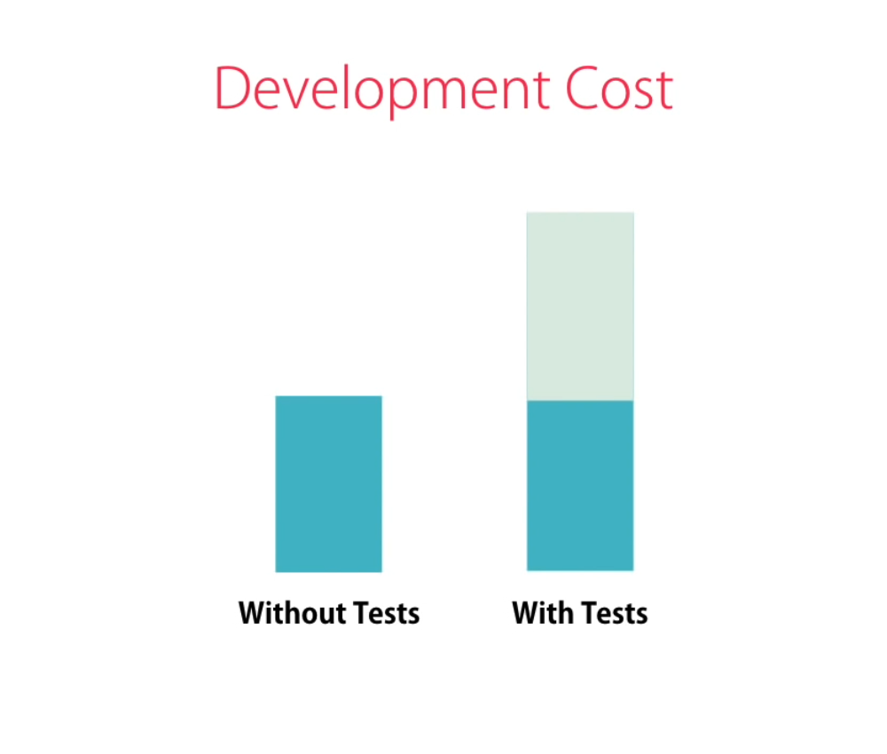
 <figcaption>&nbsp;&nbsp;&nbsp; Image - Production development cost</figcaption>
 </figure>
</p>

### Manual Testing Cost VS Automated Testing Cost

#### Manual Testing Cost
- In any application at the initial development level, Manual Testing takes less time
- As the application grows with more and more features, functionality and complexity, time is taken by Manual Testing increases exponentially-significantly
- In the longer run, many new team members are not aware of exact functionality and requirements to test as an actual old developer who developed the features are no more working with the company

#### Automated Testing Cost
- At the initial development level, Automated Testing takes more time
- In longer time over the years as and when the application grows with features and complexity, Automated Testing time decreases and it is far lesser than Manual Testing
- Now a days many companies avoid manual testing and automate everything and prefer test automation

<p>
 <figure>
 &nbsp;&nbsp;&nbsp; 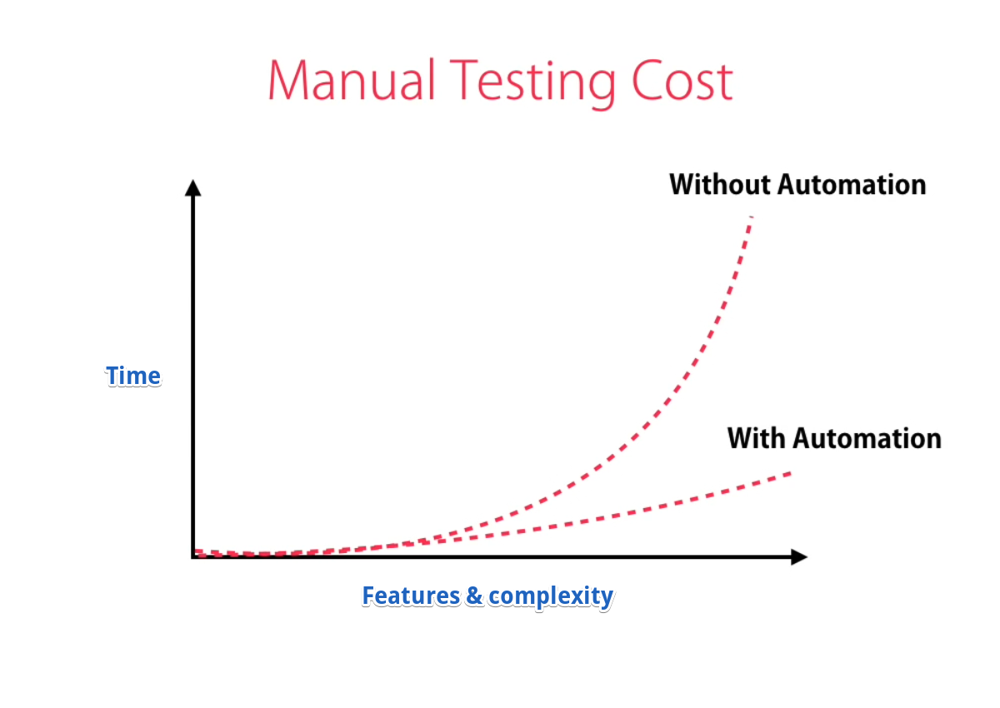
 <figcaption>&nbsp;&nbsp;&nbsp; Image - Manual vs Automated testing cost</figcaption>
 </figure>
</p>

1.6. Why Test
---------------------

Testing is important and done to:
- Get an error if code break
- Avoid last-minute shocking/breaking code changes
- Tests are the best way to prevent software defects
- Avoid any invalid/bad/unwanted code 
- Think about possible issues and bugs in code/application
- Integrate into build workflow (If all test cases succeed than merge code and deployed automatically)
- Save time in the longer run
- Break up complex code dependencies and make our code easier
- Improve code/better code quality

1.7. Benefits-Advantages of Automated Testing
---------------------

- `It helps to catch defects/bugs before releasing your application/product/software`
- With Automated Testing, we produce software with fewer bugs and of better quality and more reliable
- Tests prevent software defects
- It will help you become a better developer
- It will enforce you to write better and more reliable code
- Helps in regression testing (Testing complete application in chunks, make sure old functionalities are working fine)
- Reveals mistakes in Design/Development (If some features are difficult/complex to write test cases - simplify functionality and logic)
- In the longer run, Automated Unit Testing acts as documentation fo application functionality

1.8. Do I need Automated testing
---------------------
1.8. Real-time testing scenarios
---------------------
1.8. What world think about testing
---------------------

### Be Linguistics and Pragmatic:
- Automated testing has lots of advantages-benefits but it is not good-fit for each project and every team
- `Needed disciplined code and programmer` in team else we need to spend more time and money to fix broken code which may result in loss
- In the Real world, we have constrained for TIME and MONEY - our job is to build + deliver real working software by solving problems and deliver values to the world
- `Depends on the Project Budget, Development Time and Resources we can decide to go for Automated Testing or not`

### Automated Testing may not good for:
- A startup who have limited budget and time
- Startup companies who are not sure about product future 
- Companies who develop research-based/experimental products (R & D projects)
- Software/application in which requirements changes frequently

1.9. First code or write the test TDD BDD
---------------------
1.9. Do I write Test first (TDD - Test Driven Development) or application code first?
---------------------

- **TDD (Test Driven Development)** 
  - Sometimes, we write tests before we even start developing which is called TDD (Tests are written before the code)
  - We mostly follow BDD (Behavior Driven Development) since we are using the Jasmine framework

- **Behavior Driven Development** 
  - Behavior Driven testing is an extension of TDD 
  - Like TDD in BDD also we can write tests first and then add application code, **The major difference that we get to see here are:**
    - `Tests are written in plain descriptive English type grammar`
    - Tests are explained as a behavior of an application and are more user-focused
    - Using examples to clarify requirements

This difference brings in the need to have a language which can define, in an understandable format.

Its all depends on TIME, MONEY and need/requirements - usually, developers and companies first prefer to do application development then go for testing ie. BDD (Behavior Driven Development).


1.10. What to test
---------------------
1.10. Which Test Cases to Automate?
---------------------

**Test cases to be automated can be selected using the following criterion to increase the automation ROI:**

- High Risk - Business Critical test cases
- Test cases that are repeatedly executed
- Test Cases that are very tedious or difficult to perform manually
- Time-consuming test Cases

We can write Angular tests cases for testing Functions, Logics, Events, multiple types of Components, Attributes-Directives, Dependencies, Routers- Navigation, and services. 

While writing test we must think/test all execution scenarios like `if and else condition, positive, negative outputs, pass and fail cases, true or false switch case` etc.

**The following category of test cases are not suitable for automation:**

- Test Cases that are newly designed and not executed manually at least once
- Test Cases for which the requirements are frequently changing
- Test cases which are executed on an ad-hoc (emergency or when needed) basis


2 Different types of tests
=====================

There are different ways/types to test our application code. In Angular context, there are following types of test: `isolated and shallow unit testing (without any custom tags), integration tests between components and UI/E2E tests, which can be functional and visual regression testing`. In general, we have 3 types of tests as given below:
1. Unit Test
2. Integration Test
3. End-to-end Test (Functional Testing)

Let's go through each testing type in detail and write the right tests for ensuring the application/testing work as expected.

2.1. Unit Test
---------------------

- **`Testing a function in isolation (testing one function, test individual components of the system)`**
- This is sometimes also called `Isolated testing`, It’s the practice of `testing small isolated pieces of code`
- Test an individual component `in isolation, without external resources` (e.g. file system, server, database, API endpoints, etc.)
- In Angular terms/context `testing only component class` file without any template/view, with fake services and fake routers
- **<u>Coverage</u>** - Small Unit/chunk of code to test
- **<u>Complexity</u>** - Easier to write
- **<u>Time/Duration</u>** - Super Fast, takes less time
- **<u>Frequency</u>** - Write more/as much as you can (Hundreds)
- **<u>Funtionality Testing Confidence</u>** - Does not test the functionality of the application in detail, not give us much confidence about functionality

> **Note**:
 - To perform unit testing for application code, we need to `develop a separate program which executes each unit of the software independently`, providing proper input data from the source and then checking the output result against the expected results
 - Usually, a unit testing program is written with the same programming language in which the actual program/code-logic is developed; e.g. if we develop a program in C#/Java/JavaScript, then we need to develop its related unit testing program in C#/Java/JavaScript respectively


<p>
 <figure>
 &nbsp;&nbsp;&nbsp; 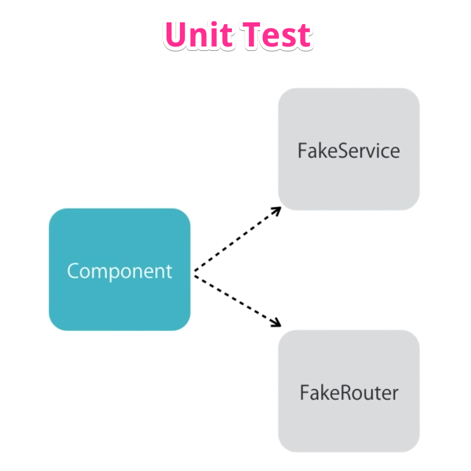
 <figcaption>&nbsp;&nbsp;&nbsp; Image - Unit Testing</figcaption>
 </figure>
</p>

2.2. Integration Test
---------------------

- **`If any Unit testing depends on external resources like databases, networks, and APIs, then it is not a unit test, it's an Integration Test`**
- Testing a Component with Template interaction, dependencies (testing a function that calls and depends on another function)
- In Angular terms/context `testing component along with template (component + template)`, with fake services and fake routers
- **<u>Coverage</u>** - Test a component `with external resources` (e.g. file system, server, database, API endpoints etc.)
- **<u>Complexity</u>** - Little complex as we need to deal with dependency injection
- **<u>Time/Duration</u>** - Little time consuming
- **<u>Frequency</u>** - Write a good couple of (Tens)
- **<u>Funtionality Testing Confidence</u>** - Give us much confidence about functionality

<p>
 <figure>
 &nbsp;&nbsp;&nbsp; 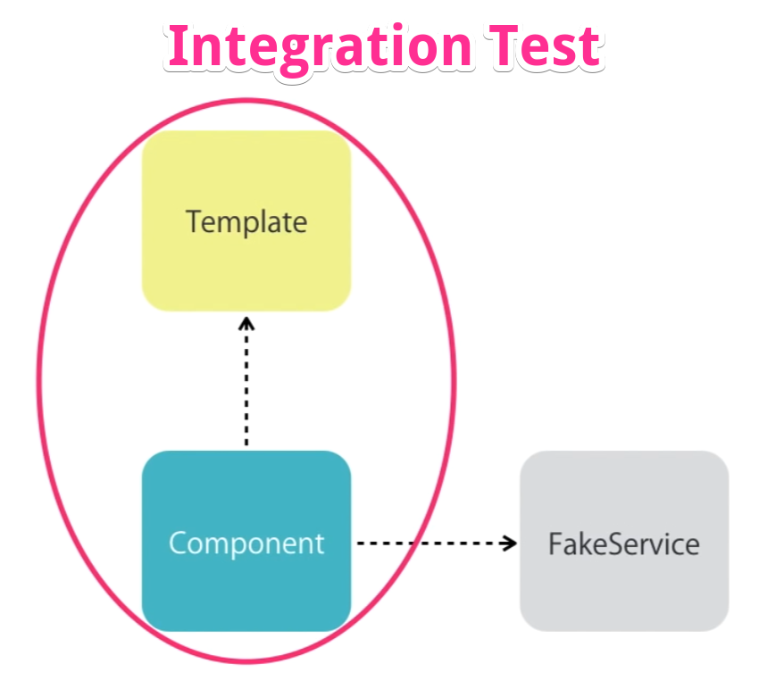
 <figcaption>&nbsp;&nbsp;&nbsp; Image - Integration Testing</figcaption>
 </figure>
</p>

2.3. End to End Test
---------------------
2.3. End-to-End or End-2-End or E2E Test or Functional Testing
---------------------

- **`Test an entire application as a whole including function, user interaction, service API calls and complete functionality`**
- This is defined as the testing of the complete functionality of an application
- End-to-End or Functional Testing simply means interacting with your application as it’s running in a browser just like a user would interact with it in real life, i.e. via clicks on a page, filling up data, etc.
- `Testing and checking application from launching in browser till individual functionality, Full flow (validating a DOM after a click)`
- **<u>Coverage</u>** - Test whole app functionality, get more confidence about functionality
- **<u>Complexity</u>** - Complex
- **<u>Time/Duration</u>** - Pretty time consuming, Tests are very slow
- **<u>Frequency</u>** - Write a few (1,2 or so)
- **<u>Funtionality Testing Confidence</u>** - Very fragile (can get broken easily) if any changes in template or component

2.4. The testing pyramid
---------------------

The testing thumb-rule/testing pyramid says that: `75-80 % of the tests should be unit tests, 15-20 % is integration tests and 5 % is End-2-End UI tests`, overall depends on companies to companies, requirements to requirements.

> **Note**: Write more Unit and Integration Test, few/less End-to-End tests only for key functionalities


3 The Angular Testing Tools-Toolchain
=====================

3.1. Testing Tool categories
---------------------

Angular testing toolchain consist of various tools of different types/categories, which can perform unit testing on Angular Framework. Some of the tools categories mentioned below:

- **<u>Assertion Library</u>**: 
    - Define test cases, write testing logic, conditions
    - Examples/Tools: Jasmine, Chai
- **<u>Test Runner</u>**: 
    - Execute our tests and summarize results 
    - Examples/Tools: Karma, Mocha
- **<u>End-to-End testing tools</u>**: 
    - Perform complete Application test
    - Examples/Tools: Protractor
- **<u>Headless Browser</u>**: 
    - Simultes browser interaction, execute tests in GUI-less browser
    - Examples/Tools: Headless chrome, Puppeteer, PhantomJS 

3.2. Testing Tools
---------------------

We can test our Angular applications from scratch by writing and executing pure javascript functions. Creating instances of the relevant classes, calling functions and checking the actual versus expected result.

But as testing is such a common activity with javascript there are several testing libraries/frameworks available to use which reduce the amount of time it takes to write tests.

Here is the list of important tools used for Angular testing:

1. Jasmine
2. Karma
3. Protractor
4. PhantomJS
5. Istanbul
6. Chai
7. Sinon
8. Mocha
9. Angular Testing Utilities

<p>
 <figure>
 
 </figure>
</p>

### 3.2.1. Jasmine

- **`Jasmine is an open-source Behavior Driven Development (BDD) framework for testing JavaScript code, BDD is an important feature of Test Driven Development (TDD)`**
- Jasmine is the most popular JavaScript testing framework in the Angular community - core framework to write a unit test
- Angular is built-in with Jasmine and Karma so it's pretty easy to get started with testing
- Jasmine provides bunch of functions to write test, e.g. `describe()`, `it()` etc.
- Dependency free and does not require a DOM (Document Object Model)
- Website URL: https://jasmine.github.io/ 

<p>
 <figure>
 
 </figure>
</p>

### 3.2.2. Karma
- **`A test runner tool for running and executing unit test while developing an Angular app`**
- Karma is a direct product of the AngularJS team and default test runner for applications created with the Angular CLI
- Shows the `outcome of all test` run whether to pass or fail
- Karma allows us to `generate various reports on the results`
- Increases developer productivity by showing/giving live results of tests
- Karma is a tool which let's use `Chrome, Firefox or provides headless browsers` and run Jasmine tests inside of them
- Website URL: https://karma-runner.github.io/latest/index.html

<p>
 <figure>
 
 </figure>
</p>

### 3.2.3. Protractor
- **`Protractor is an End-to-End/End-2-End (E2E) behavior-driven testing framework for Angular`**
- It helps QA or Testers to write and run End-to-End/End-2-End (E2E) to test complete application flow
- It Explores the app as users experience it
- Website URL: https://www.protractortest.org/#/

<p>
 <figure>
 
 </figure>
</p>

### 3.2.4. PhantomJS
- **`PhantomJS is a headless WebKit scriptable browser with a JavaScript API`**
- It has fast and native support for various web standards like DOM handling, CSS selector, JSON, Canvas, and SVG
- PhantomJS - Scriptable Headless Browser, in simple terms we can say - PhantomJS is a web browser `without a graphical user interface`
- PhantomJS can be used to take screenshots of websites, those screenshots can be rendered in different formats also
- As we can use PhantomJS to load and manipulate a web page, it is perfect for carrying out page automation. This helps developers run a bunch of tests without ever having to open a web browser
- **`PhantomJS development is suspended until further notice, PhantomJS is a discontinued headless browser used for automating web page interaction`**
- Website URL: https://phantomjs.org/

### 3.2.5. Istanbul
- **`Angular uses Istanbul and Karma for built-in testing`**
- `Istanbul is a Karma reporter` that uses the latest Istanbul 1.x APIs (with full source map support) to report coverage
- Website URL: 
  - https://www.npmjs.com/package/istanbul, 
  - https://www.npmjs.com/package/karma-coverage-istanbul-reporter

<p>
 <figure>
 
 </figure>
</p>

### 3.2.6. Sinon
- **`Standalone test spies, stubs and mocks for JavaScript (fake service/HTTP-API calls)`**
- It works with any unit testing framework and has no external dependencies
- **Installation command**: `npm install sinon`
- Jasmine already consists of `spies, Mock`, just a thought from some community that Sinon.JS is better!
- Website URL: https://sinonjs.org/ 

<p>
 <figure>
 
 </figure>
</p>

### 3.2.7. Chai
- **`Chai is a BDD / TDD assertion library for node and the browser that can be delightfully paired with any javascript testing framework`**
- `Chai is an assertion library with some tasty syntax sugar` that can be paired with any other testing framework
- Jasmine already uses a TDD style, so developers using Chai for its BDD interfaces, mainly through the use of `should` and `expect`
- **Installation command**: `npm install chai`
- Website URL: 
  - https://www.chaijs.com/
  - https://angular-2-training-book.rangle.io/testing/using-chai

<p>
 <figure>
 
 </figure>
</p>

### 3.2.8. Mocha
- **`A test runner tool for running and executing unit test while developing an Angular app`**
- Mocha is a testing framework that provides functions that are executed according to in a specific order, and that logs their results to the terminal window
- Mocha makes synchronous and asynchronous testing simple and fun, also runs test serially, allowing for flexible and accurate reporting
- **Installation command**: `npm install mocha`
- Website URL: 
  - https://mochajs.org/
  - https://github.com/mochajs/mocha

### 3.2.9. Angular Testing Utilities
- Help us to create a test environment for the complete/whole application code 
- Used to cover/test interactions and functionality as a whole
- Angular **`TestBed`** utility / Angular Test Bed (ATB):
  - The first and most important inbuilt testing utility which creates an angular testing module
  - Used to test interaction between - component and its template or with different component
  - **Package/Import statement** - `import { TestBed } from '@angular/core/testing';`

In the current course/tutorial will mainly deal with `Jasmine (to write tests) & Karma (to run the test and get results/code coverage reports) with Angular Testbed (ATB - to cover interactions and functionality)`.

4 Setup Angular test
=====================

4.1. Installing tools-utilities
---------------------

To create Angular application we need `Node/NPM/Angular CLI` to be installed on the machine, if not then go through following steps and install required tools:

1. Install Node (https://nodejs.org/en)
2. Install Angular CLI (https://cli.angular.io/) command: `npm install -g @angular/cli` OR `npm i -g @angular/cli`
3. Create a new Angular project with Angular CLI command: `ng new project/appName` OR `ng new angular-unit-test-demo`
4. Run Angular App by using Angular CLI command: `ng serve`
5. To run the test cases/test scripts command: `ng test` 
    - `ng test` command read all the spec/test files from an application with `.spec` extensions and execute them in serial order
    - `Karma` launches a headless browser window with port `9876` OR address `http://localhost:9876/?id=96650121` and shows test results and statistics (total test cases run, test pass/fail, etc.)

> **Note**: 
- We don’t have to set up anything special to start on unit testing, thanks to `Angular CLI - an Angular Command Line Interface/Utility`
- Angular CLI creates all the set up with packages and dependencies (Jasmine and karma) with `.spec test file` for us
- Any system which has `Node/NPM/Angular CLI` installed, can simply create an Angular App with the command: `ng new appName` and then 
 - run `ng test` command to start running default tests/test script present in the application in the form of `.spec` files

> **Note**: For detailed description of Node/NPM/Angular/Angular CLI Setup, please refer the following links:
 - https://github.com/dinanathsj29/angularcli-angualr-cli#02-Getting-Started-with-Angular-CLI
 - https://github.com/dinanathsj29/angular7-step-by-step#02-getting-started

<p>
 <figure>
 &nbsp;&nbsp;&nbsp; 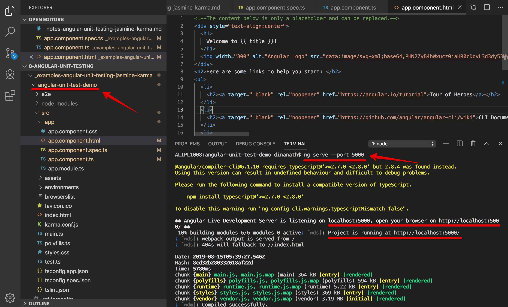
 <figcaption>&nbsp;&nbsp;&nbsp; Image - Angular App Folder Structure - ng serve</figcaption>
 </figure>
</p>

<p>
 <figure>
 &nbsp;&nbsp;&nbsp; 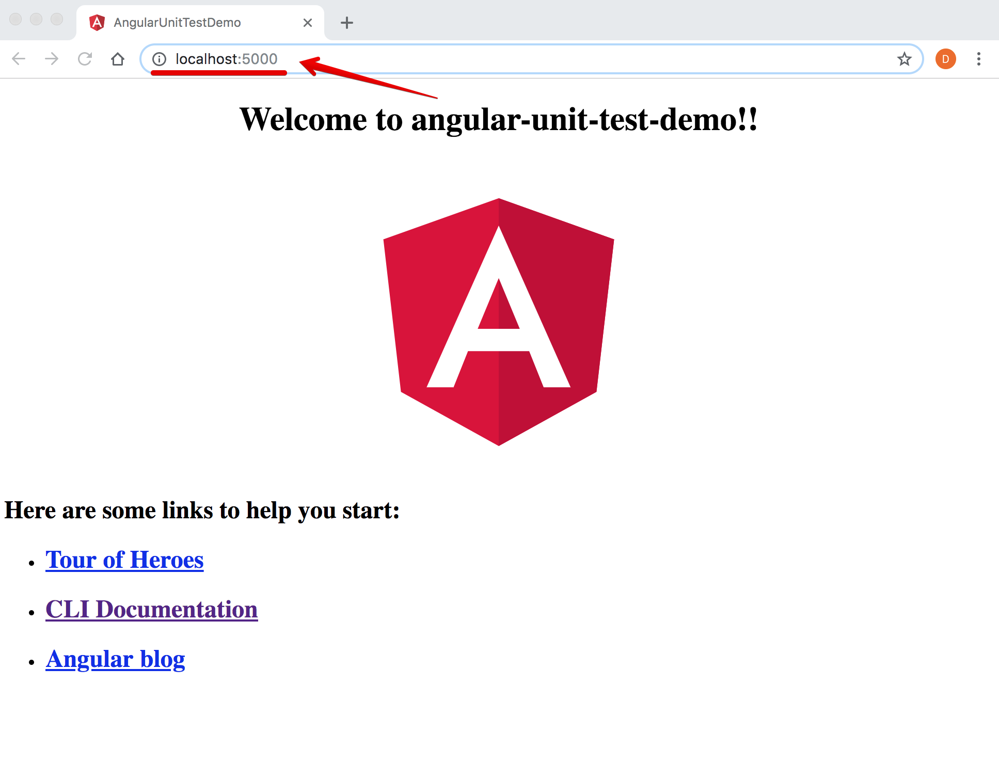
 <figcaption>&nbsp;&nbsp;&nbsp; Image - Running Angular App - ng serve output</figcaption>
 </figure>
</p>

<p>
 <figure>
 &nbsp;&nbsp;&nbsp; 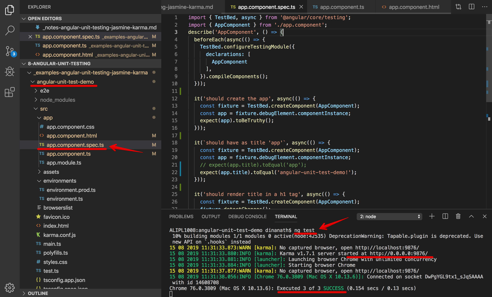
 <figcaption>&nbsp;&nbsp;&nbsp; Image - Executing ng test command</figcaption>
 </figure>
</p>

<p>
 <figure>
 &nbsp;&nbsp;&nbsp; 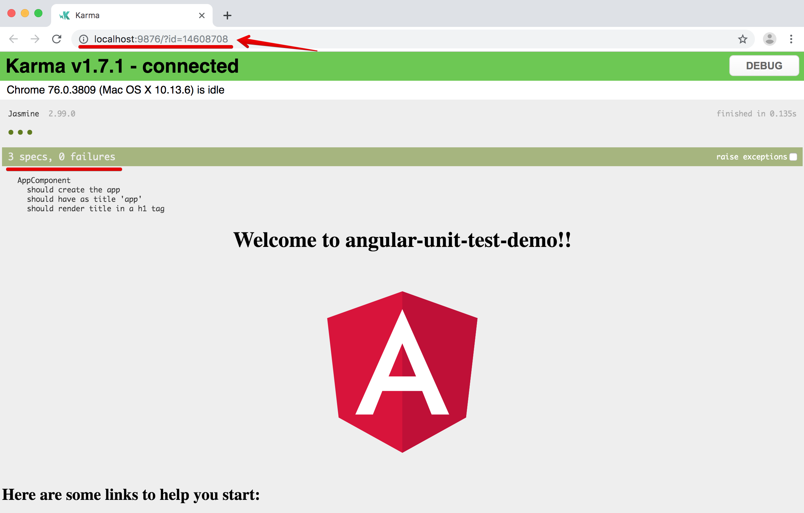
 <figcaption>&nbsp;&nbsp;&nbsp; Image - Running Angular Test - ng test output</figcaption>
 </figure>
</p>

4.2. Core package-dependencies for testing
---------------------

See the image below which lists all the dependencies installed for testing purposes. Let’s go through the more important ones:

<p>
 <figure>
 &nbsp;&nbsp;&nbsp; 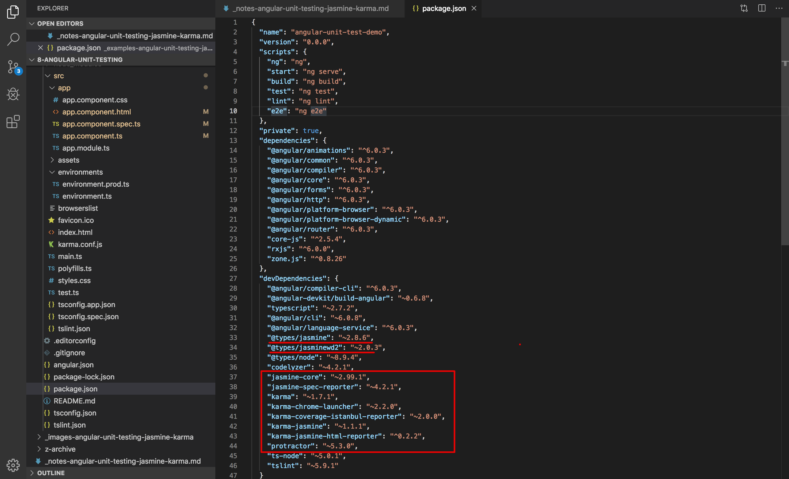
 <figcaption>&nbsp;&nbsp;&nbsp; Image - Testing packages-dependencies</figcaption>
 </figure>
</p>

- **<u>jasmine-core</u>**:
  - **`Jasmine is the framework we are going to use to create our tests (.spec files consists of Jasmine logic)`**
  - It has a bunch of functionalities to allow us the write different kinds of tests
- **<u>karma</u>**:
  - **`Karma is a task runner tool for our tests`**
  - It uses a configuration file to set the startup file, the reporters, the testing framework, the test output browser
- **<u>protractor</u>**:
  - **`End to End test writing framework`**
  - The rest of the dependencies are mainly reporters for our tests, different tools to use karma and Jasmine and browser launchers

4.3. Core test setting-configuration files
---------------------

Here are some of the core test settings/configuration files

- **<u>karma.conf.js</u>**:
  - The unit test runner configuration file 
- **<u>protractor.conf.js</u>**:
  - Protractor end-to-end test framework configuration file 
- **<u>test.ts</u>**:
  - The main entry point for unit tests and loads all the `.spec` and framework files 
  - The angular-cli configuration of karma uses the file `test.ts` as the entry point of the tests for the application 
  - This file is required by karma.conf.js and loads recursively all the .spec and framework files


5 Fundamentals of Unit Testing
=====================

5.1. Clean coding principles-best practices
---------------------

- Need to `follow clean coding practices` for writing code of development as well as test cases
 - Small functions/methods (10 lines of code or less)
 - Proper naming conventions for variables and functions/methods (Follow clear and consistent naming conventions for your unit tests)
 - Single responsibility principle (one function should do/perform one task only)
 - Unit Test cases should be independent (In case of any enhancements or change in requirements, unit test cases should not be affected)
 - Test only one code at a time
 - While writing test we must think/test all execution scenarios like `if and else condition, positive, negative outputs, pass and fail cases, true or false switch case` etc.
 - In case of a change in code in any module, ensure there is a corresponding unit Test Case for the module, and the module passes the tests before changing the implementation
 - Bugs identified during unit testing must be fixed before proceeding to the next phase in SDLC (Software Development Life Cycle)
 - Adopt a `test as you code` approach, The more code you write without testing, the more paths you have to check for errors

5.2. Creating a spec test file
---------------------

1. Create a new Test file which should have `.spec.ts` extension
    - Every class/component file should have its corresponding Unit Test case file with `.spec.ts` extension 
    - `(e.g.: component = header.component.ts, unit testing/spec file = header.component.spec.ts)`
2. Angular development team recommends putting/keeping unit test scripts alongside the files they are testing and using a `.spec` filename extension to mark it as a testing script (it's a Jasmine convention) 
    - `header.component.ts, header.component.spec.ts` - should present under one folder
3. Inside `.spec` test file write Unit Test cases as per logic/functionality mentioned and/or as per specific needs-requirements in the component class file
4. To run the test cases/test scripts, use Angular CLI command: `ng test`

5.3. How to write unit tests
---------------------

### 5.3.1. Unit Test Syntax

```typescript
// 1. describe - define test suite, Create a group of specs (often called a suite)

describe('Textual description of the group', Function for Jasmine to invoke that will define inner suites specs () => {

 // 2. it - define an individual unit test case
 
 it('expectation from current test case', () => {

 // 3. expect - Create an expectation/assertion for a spec, expect().matcherFunction();
 
 expect(expectation).toBe(expected);

 })

})
```

<hr/>

### 5.3.2. Unit Test Code

```typescript
// 1. describe - define test suite, Create a group of specs (often called a suite)

describe('HeaderComponent', () => {

 // 2. it - define an individual unit test case
 
 it('should have header title', () => {

 // 3. expect - Create an expectation for a spec/assertion, expect().matcherFunction();

 let title = 'Welcome to Angular Testing';
 
 expect(title).toEqual('Welcome to Angular Testing');

 })

})
```

<hr/>

### 5.3.3. Simple function to test with jasmine

> **Syntax & Example**: `function.ts:`

```typescript
function sayHello() {

    return 'Hello World!!!';

}
```

> **Syntax & Example**: `Jasmine test .spec.ts:`

```typescript
describe('Say Hello', () => { 

  it('should says Hello World', () => { 

    expect(sayHello()) 

        .toEqual('Hello World!!!'); 

  });
  
});
```

5.4. Widely used Angular Unit Testing functions
---------------------
5.4. Widely used Angular Unit Testing functions / Structure of Unit Test Case:
---------------------
1. describe()
2. it()
3. expect()
4. Various Matcher functions

### 5.4.1. describe()
- **`describe() function block define a test suite (the group of related tests)`**
- The `describe(string, function)` function defines what we call a `Test Suite`, a collection of individual `Test Specs`
- Usually, with describe block we define/describe - the name of the current component to test
- e.g. 
 
```typescript
describe('test-suite-name / component-name', () => { 

}) 

OR 

describe('LoginComponent', () => { 

}) 
```

### 5.4.2. it()
- **`it() block define a individual spec or test`**
- The `it(string, function)` function defines an individual `Test Spec`, this contains one or more `Test Expectations`
- The `it` block must have proper readable and meaningful statement as a Test Spec/description
- With in `describe()`, we can `have one or more it() functions` - (group of related test/sepc)
- Inside `it()` block `define test/code behavior` - expectation/assertion
- e.g. 
 
```typescript
it('test-spec-name', () => { 

})

OR 

it('should have/show submit button', () => { 

}) 
```

### 5.4.3. expect()
- **`expect() function block is Jasmine API for checking expectation/assertion`**
- The `expect(actual)` expression is what we call an Expectation
- Takes actual value as the parameter
- Chained with a Matcher function
- In conjunction with a `Matcher Function,` it describes an expected piece of behavior in the application
- e.g. 

```typescript
expect(something).matcherFunction(value expected)

OR 

expect(var-name).toBe(value);
expect(var-name).toContain(value);
expect(var-name).toEqual(value);
expect(var-name).toBeNull(value);
expect(var-name).toBeTruthy(value);
expect(var-name).toBeFalsy(value);
```

### 5.4.4. Various Matcher functions() - Built-in matchers
- **`The matcher(expected) expression is what we call a Matcher`**
- It does a boolean comparison with the `expected` value passed in VS. the `actual` value passed to the `expect` function if they are false the spec fails
- It is responsible for reporting to Jasmine if the expectation is true or false, Jasmine will then pass or fail the spec/test
- **Jasmine comes with a rich set of pre-built matchers like:**

```typescript
expect(array).toContain(member);
expect(fn).toThrow(string);
expect(fn).toThrowError(string);
expect(instance).toBe(instance);
expect(mixed).toBeDefined();
expect(mixed).toBeFalsy();
expect(mixed).toBeNull();
expect(mixed).toBeTruthy();
expect(mixed).toBeUndefined();
expect(mixed).toEqual(mixed);
expect(mixed).toMatch(pattern);
expect(number).toBeCloseTo(number, decimalPlaces);
expect(number).toBeGreaterThan(number);
expect(number).toBeLessThan(number);
expect(number).toBeNaN();
expect(spy).toHaveBeenCalled();
expect(spy).toHaveBeenCalledTimes(number);
expect(spy).toHaveBeenCalledWith(...arguments);
```

6 Starting with Unit Testing
=====================

Till now we know and learned that **Unit testing is nothing but `testing only component class` file without any template/view or external dependencies, with fake services and fake routers. so its time to learn basics-fundamentals to advanced level of unit testing**

**<u>As and when we are running the test, it should run in an isolated mode - as its only test exist in the .spec.ts file</u>**

1. **Comment/Remove old test cases (app.component.spec.ts)** - To avoid any confusion/conflicts with pre-existing tests, please comment/remove all the test cases (3 tests) available in `app.component.spec.ts` file.

6.1. Unit Testing-Functions
---------------------

### 6.1.1. Creating the first component to test

1. Create a new folder and first component file - `app/01-unit-test/01-fundamentals-functions/01-counter.ts`

> **Syntax & Example**: `01-fundamentals-functions/01-counter.ts`

```typescript
export class CounterComponent {

 public counter: number = 0;

 // increment
 public increaseCounter(): number {

 this.counter++;

 return this.counter;

 }

 // decrement
 public decreaseCounter(): number {

 this.counter--;

 return this.counter;

 }

} // class CounterComponent
```

<p>
 <figure>
 &nbsp;&nbsp;&nbsp; 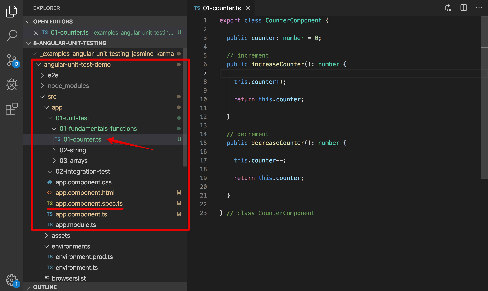
 <figcaption>&nbsp;&nbsp;&nbsp; Image - Unit Testing file/folder - counter component</figcaption>
 </figure>
</p>


### 6.1.2. Creating the first test script

1. Create a .spec/test file - `01-counter.spec.ts` and write test case for following scenarios:
    - if `increaseCounter` function called than `curCounterValue` value will be greater than zero (positive) 

> **Syntax & Example**: `01-fundamentals-functions/01-counter.spec.ts` 

```typescript
// import component to test 
import { CounterComponent } from "./01-counter";

// 1. describe - define test suite, Create a group of specs (often called a suite)
describe('CounterComponent', ()=> {

 // 2. it - define an individual unit test case
 it ('should check incremented value is greater than zero', ()=> {
 
 // dependency injection
 let counterComponent: CounterComponent = new CounterComponent();

 const curCounterValue = counterComponent.increaseCounter();

 // 3. expect - Create an expectation/assertion for a spec
 expect(curCounterValue).toBeGreaterThan(0);

 }) 

}) // describe
```

<p>
 <figure>
 &nbsp;&nbsp;&nbsp; 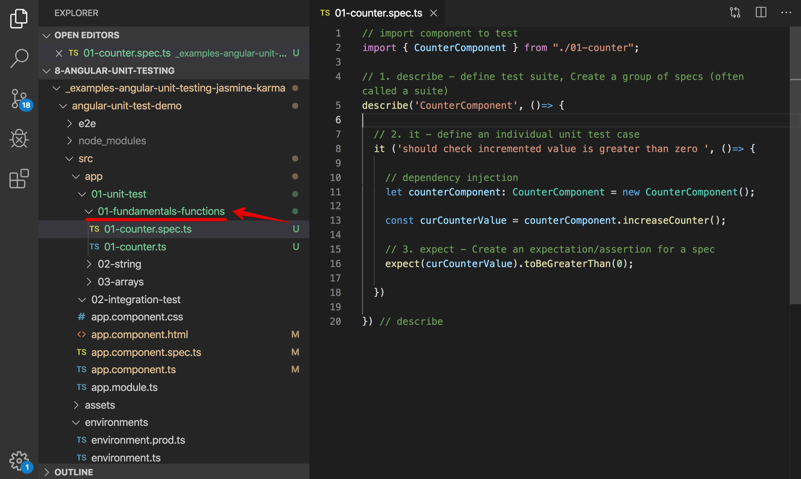
 <figcaption>&nbsp;&nbsp;&nbsp; Image - Unit Testing - counter .spec test file</figcaption>
 </figure>
</p>

### 6.1.3. Running/Executing the first test script

1. Run the test cases/test scripts, by using Angular CLI command: `ng test`

<p>
 <figure>
 &nbsp;&nbsp;&nbsp; 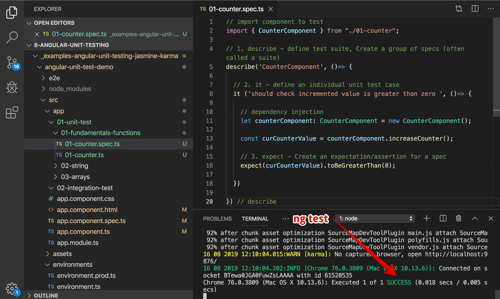
 <figcaption>&nbsp;&nbsp;&nbsp; Image - Unit Testing - Running test</figcaption>
 </figure>
</p>


<p>
 <figure>
 &nbsp;&nbsp;&nbsp; 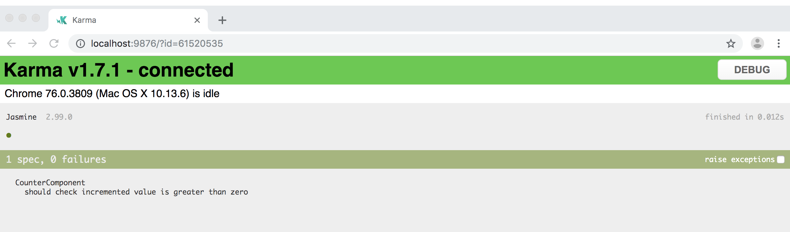
 <figcaption>&nbsp;&nbsp;&nbsp; Image - Unit Testing - Running test - Browser Karma output</figcaption>
 </figure>
</p>

### 6.1.4. Write and add other test cases in .spec file

1. Write another test case for the negative scenario as:
    - in case of `decreaseCounter` function executed curCounterValue value will be less than zero (negative) 

```typescript
it ('should check decremented value is less than zero', ()=> {
 
 let counterComponent: CounterComponent = new CounterComponent();

 const curCounterValue = counterComponent.decreaseCounter();

 expect(curCounterValue).toBeLessThan(0);

}) 
```

<hr/>

> **Syntax & Example**: final `01-fundamentals-functions/01-counter.spec.ts` 

```typescript
// import component to test 
import { CounterComponent } from "./01-counter";

// 1. describe - define test suite, Create a group of specs (often called a suite)
describe('CounterComponent', ()=> {

 // 2. it - define an individual unit test case
 it ('should check incremented value is greater than zero', ()=> {
 
 // dependency injection
 let counterComponent: CounterComponent = new CounterComponent();

 const curCounterValue = counterComponent.increaseCounter();

 // 3. expect - Create an expectation/assertion for a spec
 expect(curCounterValue).toBeGreaterThan(0);

 }) 

 it ('should check decremented value is less than zero', ()=> {
 
 let counterComponent: CounterComponent = new CounterComponent();

 const curCounterValue = counterComponent.decreaseCounter();

 expect(curCounterValue).toBeLessThan(0);

 }) 

}) // describe
```

<p>
 <figure>
 &nbsp;&nbsp;&nbsp; 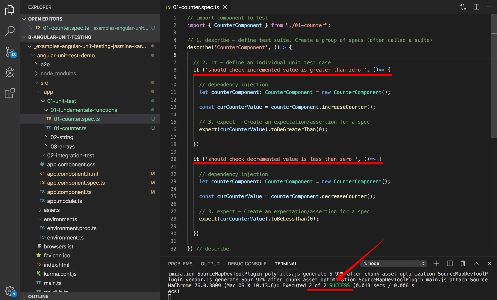
 <figcaption>&nbsp;&nbsp;&nbsp; Image - Unit Testing - Running all tests</figcaption>
 </figure>
</p>


<p>
 <figure>
 &nbsp;&nbsp;&nbsp; 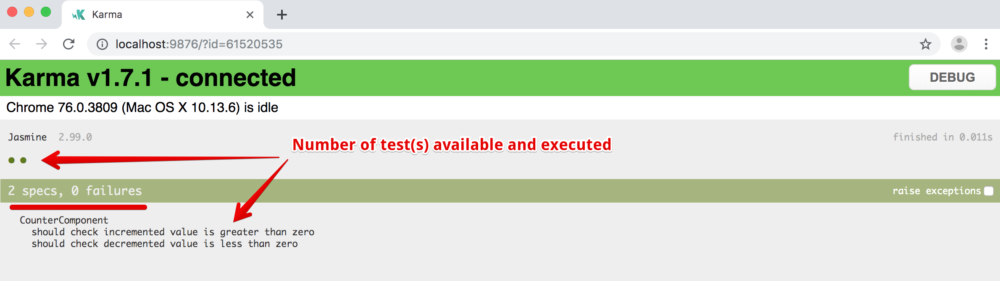
 <figcaption>&nbsp;&nbsp;&nbsp; Image - Unit Testing - Running all test - Browser Karma output</figcaption>
 </figure>
</p>


6.2. Unit Testing-Parameterized Functions
---------------------

### 6.2.1. Simple calculator with parameterized function

> **Syntax & Example**: `02-parameterized-functions/01-parameter-counter.ts`

```typescript
export function counterParameter(num): number {

 if (num < 0) {

 return 0

 } else {

 return num + 1;
 }

}
```

<hr/>

> **Syntax & Example**: `02-parameterized-functions/01-parameter-counter.spec.ts`

```typescript
// import function/component to test 
import { counterParameter } from "./01-parameter-counter";

// 1. describe - define test suite, Create a group of specs (often called a suite)
describe('counterParameter', ()=> {

 // 2. it - define an individual unit test case
 it ('should return zero 0 if input is negative', ()=> {
 
 const counterResult = counterParameter(-1);

 // 3. expect - Create an expectation/assertion for a spec
 expect(counterResult).toBe(0);
 expect(counterResult).toBeLessThanOrEqual(0);

 }) 

 it ('should increment if input is positive', ()=> {
 
 const counterResult = counterParameter(1);

 expect(counterResult).toBe(2);

 }) 
 
}) // describe
```

### 6.2.2. Dimension calculator with parameterized function

> **Syntax & Example**: `02-parameterized-functions/02-parameter-dimension-calculator.ts`

```typescript
export class DimensionCalculator {

 public getArea(length: number, width: number): number {

 let area = length * width;

 return area;

 }

}
```

<hr/>

> **Syntax & Example**: `02-parameterized-functions/02-parameter-dimension-calculator.ts`

```typescript
// import function/component to test 
import { DimensionCalculator } from "./02-parameter-dimension-calculator";

// 1. describe - define test suite, Create a group of specs (often called a suite)
describe('DimensionCalculator', () => {

 // 2. it - define an individual unit test case
 it('should return area equal or greater than 100', () => {

 // dependency injection
 let dimensionComponent: DimensionCalculator = new DimensionCalculator();

 const areaResult = dimensionComponent.getArea(10, 10);

 // 3. expect - Create an expectation/assertion for a spec
 expect(areaResult).toBeGreaterThanOrEqual(100);

 })

}) // describe
```

6.3. Running a specific test case
---------------------
6.3. Ignore/prevent unwanted test case to run
---------------------
6.3. Disabled and focused tests
---------------------

- The `.spec.ts` test file may contain multiple test cases/test scripts, as in current application `01-counter.spec.ts` file has a total 2 test cases. Let's see, learn and deal with required or unwanted test cases:

### 6.3.1. Focused tests / Run a Specific test

- To run a specific test from a bunch of tests cases, one can simply put/use/insert `f` before `it() function block`

```typescript

fit ('should check incremented value is greater than zero ', ()=> { })

```

- Developer can also focus on specific test suits by pre-pending `f` with `describe()`:

```typescript
fdescribe('Say Hello', () => { 

  fit('should says Hello World', () => { 

    expect(sayHello()) 

        .toEqual('Hello World!!!'); 

  });
  
});
```

<p>
 <figure>
 &nbsp;&nbsp;&nbsp; 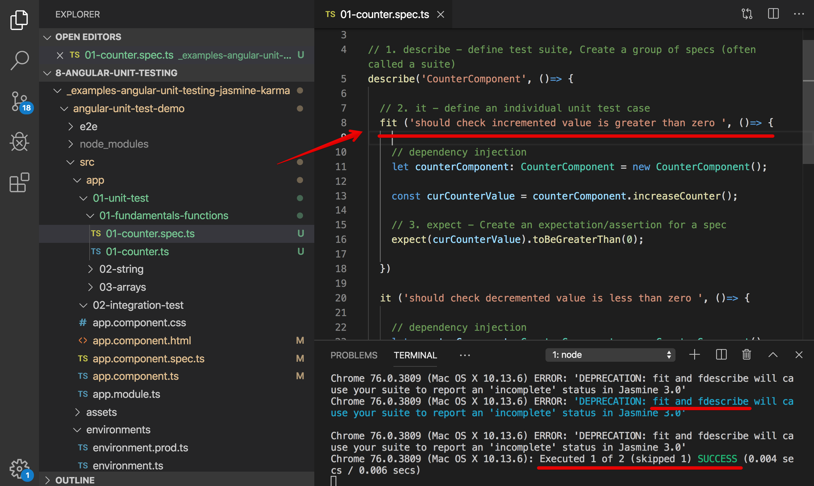
 <figcaption>&nbsp;&nbsp;&nbsp; Image - Unit Testing - Running specific test</figcaption>
 </figure>
</p>


<p>
 <figure>
 &nbsp;&nbsp;&nbsp; 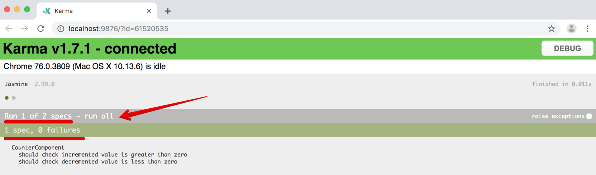
 <figcaption>&nbsp;&nbsp;&nbsp; Image - Unit Testing - Running specific test - Browser Karma output</figcaption>
 </figure>
</p>

### 6.3.2. Disable tests / Ignore test

- To disable test put/use/insert `x` before `it() function block`, it will prevent running that particular specs/test scripts
    - In the below scenario, 2nd test case with `x` will be ignored/disabled

```typescript

it ('should check incremented value is greater than zero ', ()=> { })


xit ('should check decremented value is less than zero ', ()=> { })

```

- The developer can easily disable test suit or tests without commenting them out but by just pre-pending `x to the describe` or `it functions`:

```typescript
xdescribe('Say Hello', () => { 

  xit('should says Hello World', () => { 

    expect(sayHello()) 

        .toEqual('Hello World!!!'); 

  });
  
});
```

> **Note**: We can use `f` and `x` even with `describe() block` to run specific test suit or to ignore unwanted test suit

<p>
 <figure>
 &nbsp;&nbsp;&nbsp; 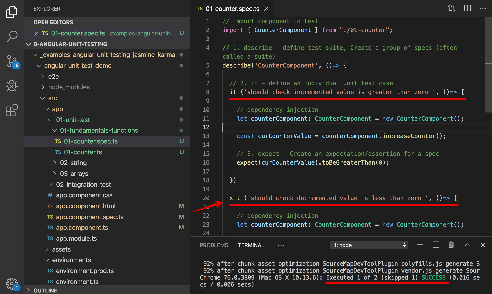
 <figcaption>&nbsp;&nbsp;&nbsp; Image - Unit Testing - Ignore specific test</figcaption>
 </figure>
</p>


<p>
 <figure>
 &nbsp;&nbsp;&nbsp; 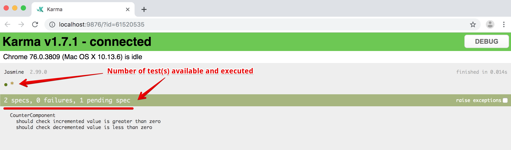
 <figcaption>&nbsp;&nbsp;&nbsp; Image - Unit Testing - Ignore specific test - Browser Karma output</figcaption>
 </figure>
</p>


6.4. Unit Testing-Strings
---------------------

> **Note: What to test?**
- Just check availability `.toContain()` of particuler text/string
- With Strings and Arrays dont write very specific/fragile unit test case (with .`toBe()` matcher function) - if specific string not availble then it may break easily 
- instead, its advisable to use `.toContain()` matcher function - to check availability of particuler text/string

> **Syntax & Example**: `04-strings/01-string-greetings.ts`

```typescript
export function greetingsTo(personName: string) {

 return 'Welcome ' + personName;
 // return 'Hello ' + personName;

}
```

<hr/>

> **Syntax & Example**: `04-strings/01-string-greetings.spec.ts`

```typescript
// import function/component to test 
import { greetingsTo } from "./01-greetings";

// 1. describe - define test suite, Create a group of specs (often called a suite)
describe('GreetingString', () => {

 // 2. it - define an individual unit test case
 it('should include person name in the greeting message', () => {

 // 3. expect - Create an expectation/assertion for a spec
 expect(greetingsTo('Dinanath')).toContain('Welcome Dinanath');
 // expect(greetingsTo('Dinanath')).toContain('Hello Dinanath');

 })

}) // describe
```

6.5. Unit Testing-Arrays
---------------------

> **Note: What to test?**
 - While testing an array we must need to assert/test/check that array must include-contains particular item/string/value, irrespective of its exact position in an array

> **Syntax & Example**: `05-arrays/01-array-country.ts`

```typescript
export function getCountry() {

 return ['India', 'Russia', 'Japan', 'israel', 'France'];

}
```

<hr/>

> **Syntax & Example**: `05-arrays/01-array-country.spec.ts`

```typescript
// import function/component to test 
import { getCountry } from "./01-array-country";

// 1. describe - define test suite, Create a group of specs (often called a suite)
describe('ArrayGetCountry', () => {

 // 2. it - define an individual unit test case
 it('should return supported country in array', () => {

 // 3. expect - Create an expectation/assertion for a spec
 expect(getCountry()).toContain('India');
 expect(getCountry()).toContain('Russia');
 })

 it('should return supported country in array', () => {

 const countryResult = getCountry();
 expect(countryResult).toContain('India');
 expect(countryResult).toContain('Israel');

 })

}) // describe
```

6.6. Set Up and Tear Down
---------------------
6.6. Triple-A - AAA - 3A - Arrang, Act and Assert pattern/structure
---------------------

### 6.6.1. SetUp and TearDown

- **Set Up**: 
  - Sometimes to test a feature we need to perform some setup, perhaps it’s creating some test objects, components initialization, dependency injection, etc.
  - Code written in `beforeEach()` function is known as `Set Up`

- **Tear Down**: 
  - Also, we may need to perform some cleanup activities after we have finished testing, like reset object/variable value, perhaps we need to delete some files from the hard drive, etc.
  - Code written in `afterEach()` function is known as `Tear Down`

Jasmine has a few functions we can use to make the activities named setup and teardown easier:

1. **beforeAll()**:
    - This function is called once, before all the specs in `describe` test suite is run

2. **afterAll()**:
    - This function is called once `after all the specs in a test suite are finished`

3. **beforeEach()**:
    - Jasmine calls this function before each and every test - `it` function
    - This function is called before each test specification, `it` function, has been run
    - Its advisable to put `common things/initialize` variables/object inside `beforeEach()` function
    - `beforeEach` runs before each test and is used for the `setup` part of a test

4. **afterEach()**:
    - Jasmine calls this function after every test - `it` function
    - This function is called after each test specification has been run
    - Runs after each test and is used for the `teardown` part of a test

> **Syntax & Example**: `06-setup-and-teardown/01-setup-teardown-beforeall-afterall.ts`

```typescript

export function sayHello() {

  return 'Hello World!!!';

}

```

> **Syntax & Example**: `06-setup-and-teardown/06-setup-and-teardown/01-setup-teardown-beforeall-afterall.spec.ts`

```typescript
// import component to test 
import { sayHello } from "./02-setup-teardown-beforeall-afterall";

// 1. describe - define test suite, Create a group of specs (often called a suite)
describe('Say Hello', () => {

  let expectedResult = '';

  // setup - initialize objects and variables
  beforeEach(() => {
    expectedResult = 'Hello World!!!';
    console.log('setup beforeEach', expectedResult);
  })

  // teardown - reset object/variable value
  afterEach(() => {
    expectedResult = '';
    console.log('teardown afterEach', expectedResult);
  })

  // 2. it - define an individual unit test case
  it('should says Hello World', () => {

    // 3. expect - Create an expectation/assertion for a spec
    expect(sayHello()) 

        .toEqual(expectedResult); 

  })

}) // describe
```

### 6.6.2. Tripple A - AAA - 3A - Arrang, Act and Assert pattern/structure

The `AAA (Arrange, Act, Assert) pattern/structure` is a common way of writing unit tests for a method under test. It suggests that you should divide your test method into three sections: `arrange, act and assert`. It also makes the test more clean and readable.

- **Arrang**: 
  - Initialize system under test
  - The `Arrange` section of a unit test method `initializes objects` and `sets the value` of the data that is passed to the method under test
  - ```let component = new ComponentToCheck();```
 
- **Act**: 
  - Calling a method/function which perform some activity
  - ```component.methodFunction();```
 
- **Assert**: 
  - The fact to check/test
  - The `Assert section verifies` that the action of the method under test behaves as expected

```typescript

expect(var-name).toBe(value);
expect(var-name).toContain(value);
expect(var-name).toEqual(value);
expect(var-name).toBeNull(value);
expect(var-name).toBeTruthy(value);
expect(var-name).toBeFalsy(value);

```

<hr/>

> **Syntax & Example**: `06-setup-and-teardown/02-counter.ts`

```typescript
export class CounterComponent {

 public counter: number = 0;

 // increment
 public increaseCounter(): number {

 this.counter++;

 return this.counter;

 }

 // decrement
 public decreaseCounter(): number {

 this.counter--;

 return this.counter;

 }

} // class CounterComponent
```

<hr/>

> **Syntax & Example**: `06-setup-and-teardown/0201-basic-simple-counter.spec.ts`

```typescript
import { CounterComponent } from "./01-counter";

describe('BasicSimplefCounterComponent', () => {

 it('should check incremented value is greater than zero', () => {

 let counterComponent: CounterComponent = new CounterComponent();

 const curCounterValue = counterComponent.increaseCounter();

 expect(curCounterValue).toBeGreaterThan(0);

 })

 it('should check decremented value is less than zero', () => {

 let counterComponent: CounterComponent = new CounterComponent();

 const curCounterValue = counterComponent.decreaseCounter();

 expect(curCounterValue).toBeLessThan(0);

 })

})
```

<hr/>

> **Syntax & Example**: `06-setup-and-teardown/0202-aaa-arrange-act-assert-counter.spec.ts`

```typescript
import { CounterComponent } from "./01-counter";

describe('ArrangeActAssertCounterComponent', () => {

 it('should check incremented value is greater than zero', () => {

 // Arrange - dependency injection
 let counterComponent: CounterComponent = new CounterComponent();

 // Act - call a method/function
 const curCounterValue = counterComponent.increaseCounter();

 // Assert - 3. expect - Create an expectation/assertion for a spec
 expect(curCounterValue).toBeGreaterThan(0);

 })

 it('should check decremented value is less than zero', () => {

 // Arrange - dependency injection
 let counterComponent: CounterComponent = new CounterComponent();

 // Act - call a method/function
 const curCounterValue = counterComponent.decreaseCounter();

 // Assert - 3. expect - Create an expectation/assertion for a spec
 expect(curCounterValue).toBeLessThan(0);

 })

})
```

<hr/>

> **Syntax & Example**: `06-setup-and-teardown/0203-setup-teardown-counter.spec.ts`

> **Note**: To follow Setup and TearDown methodology we can remove the common/repetitive code from `it() block` and put in the body of test suit ie. `inside describe() block`

```typescript
import { CounterComponent } from "./01-counter";

describe('SetupTearDownCounterComponent', () => { 

 // Arrange - dependency injection
 let counterComponent: CounterComponent;

 // setup - initialize objects and variables
 beforeEach(() => {

 counterComponent = new CounterComponent();

 })

 it('should check incremented value is greater than zero', () => {

 // Act - call a method/function
 const curCounterValue = counterComponent.increaseCounter();

 // Assert - 3. expect - Create an expectation/assertion for a spec
 expect(curCounterValue).toBeGreaterThan(0);

 })

 it('should check decremented value is less than zero', () => {

 // Act - call a method/function
 const curCounterValue = counterComponent.decreaseCounter();

 // Assert - 3. expect - Create an expectation/assertion for a spec
 expect(curCounterValue).toBeLessThan(0);

 })

}) 
```

6.7. Unit Testing-Forms
---------------------

> **Note: What to test?**
 - At the time of `LoginFormComponent initialization`, it must have `FormGroup` with three controls `name`, `password` and `email`
 - Insure `Validataors` for controls should be present/available/used

> **Syntax & Example**: `07-forms/01-loginform.component.ts`

```typescript
import { FormBuilder, FormGroup, Validator, Validators } from "@angular/forms";

export class LoginFormComponent {

 loginForm: FormGroup;

 constructor(loginFB: FormBuilder) {

  this.loginForm = loginFB.group({

  name: ['', Validators.required],
  password: ['', Validators.minLength(8)],
  email: ['', Validators.email]
 
 })

 }

}
```

<hr/>

> **Syntax & Example**: `07-forms/01-loginform.component.spec.ts`

```typescript
import { LoginFormComponent } from "./01-loginform.component";

import { FormBuilder } from "@angular/forms";

describe('LoginFormComponent', () => { 

 let loginFormComponent: LoginFormComponent;

 beforeEach(() => {

 loginFormComponent = new LoginFormComponent(new FormBuilder);

 })

 it('should create a form with 3 controls', () => {

 expect(loginFormComponent.loginForm.contains('name')).toBe(true);
 expect(loginFormComponent.loginForm.contains('password')).toBeTruthy();
 expect(loginFormComponent.loginForm.contains('email')).toBeTruthy();

 })

 it('should make the name control required', () => {

 let nameControl = loginFormComponent.loginForm.get('name');

 nameControl.setValue('');

 expect(nameControl.valid).toBeFalsy();

 })

 it('should use password with minimum 8 characters', () => {

 let passwordControl = loginFormComponent.loginForm.get('password');

 passwordControl.setValue('12345678')

 expect(passwordControl.valid).toBeTruthy();

 })

 it('should validate the email input type', () => {

 let emailControl = loginFormComponent.loginForm.get('email');

 emailControl.setValue('dinanathj@gmail.com')

 expect(emailControl.valid).toBeTruthy();

 })

}) 
```

6.8. Unit Testing-Event Emitters <!-- ??? -->
---------------------

> **Note: What to test?**
 - `EventEmitters are observables, so subscribe to them and test/check the emitted event/value`

> **Syntax & Example**: `08-event-emitter/01-event-emitter-count.component.ts`

```typescript
import { EventEmitter } from "@angular/core";

export class EventCounterComponent {

 totalCount = 0;

 counterChanged = new EventEmitter();

 incrementCounter() {

 this.totalCount++;
 this.counterChanged.emit(this.totalCount);
 
 }

}
```

<hr/>

> **Syntax & Example**: `08-event-emitter/01-event-emitter-count.component.spec.ts`

```typescript
import { EventCounterComponent } from "./01-event-emitter-count.component";

describe('EventCounterComponent', () => { 

 let eventCounterComponent: EventCounterComponent;

 beforeEach(() => {

 eventCounterComponent = new EventCounterComponent();

 })

 it('should raise counterChanged event when incrementCounter fired', () => {

 let totalCounter = 0; 
 // let totalCounter = null;

 eventCounterComponent.counterChanged.subscribe(_totalCount => {

 totalCounter = _totalCount;

 eventCounterComponent.incrementCounter();

 expect(totalCounter).toBe(1);
 // expect(totalCounter).not.toBeNull();

 })

 })

}) 
```

6.9. Unit Testing Limitations
---------------------
There are some limitations with unit tests:
- `Routers` (Not able to cover with Unit Test. we need to load component in Angular environment so need to follow Integration testing)
- `Template interpolation and binding` (With a Unit test, not sure properties bound properly in the template )
- `Event Handlers` (click event or so)
- Unit testing `can't be expected to catch every error` in a program
- It is `not possible to evaluate all execution paths` even in the most trivial/small programs
- Unit testing focuses on a unit of code, hence it `can't catch integration errors` or broad system-level errors

7 Code coverage
=====================

- As and when we write the test for our application we must need to know and understand how much code has been covered under test cases 
- `Code coverage` represents how much `percent of code is covered with unit tests`
- With the Angular CLI, we can run unit tests as well as create code coverage reports - Code coverage reports allow us to see any parts of our code base that may not be properly tested by our unit tests
- `karma.conf.js` consists of a key `coverageIstanbulReporter` for code coverage related settings:

> **If your team decides on a set minimum amount to be unit tested you can enforce this minimum with the Angular CLI:**

- The `thresholds` property will enforce a minimum of `80%` code coverage when the unit tests are run in the project


```typescript

coverageIstanbulReporter: {
 dir: require('path').join(__dirname, '../coverage'),
 reports: ['html', 'lcovonly'],
 fixWebpackSourcePaths: true
},

coverageIstanbulReporter: {
 reports: [ 'html', 'lcovonly' ],
 fixWebpackSourcePaths: true,
 thresholds: {
 statements: 80,
 lines: 80,
 branches: 80,
 functions: 80
 }
}

```

- If you want to `create code-coverage reports every time you test`, you can set the following option in the CLI configuration file, `angular.json`: This will produce code coverage results whenever tests are run for the project

```typescript
"test": {
 "options": {
 "codeCoverage": true
 }
}

```

To find out exact code coverage percentage / To generate a coverage report run the following command in the root of your project:
- `ng test --codeCoverage` OR
- ng test --code-coverage

Generate the code-coverage report at the same time close Karma test window (don't watch unit test cases):
- ng test --no-watch --code-coverage
- ng test --watch=false --code-coverage

> **Output:**
- Angular CLI generates the coverage report in a separate folder called `coverage` at the root
- Every folder in the `coverage/src/app` has his index.html, we can load that in the browser to see the actual report for that particular folder or module
- `coverage/index.html`: To check the final report on code coverage of every individual component or page/files or folders
- `coverage/src/index.html`: Shows report of `polyfills.ts` and `test.ts`

<p>
 <figure>
 &nbsp;&nbsp;&nbsp; 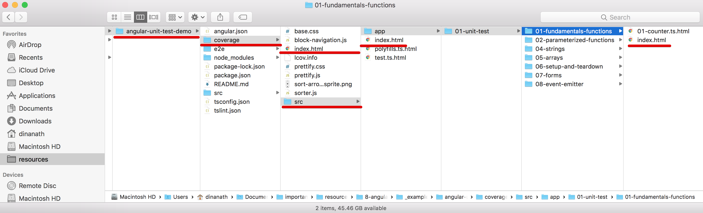
 <figcaption>&nbsp;&nbsp;&nbsp; Image - code coverage - folder structure </figcaption>
 </figure>
</p>

<hr/>

<p>
 <figure>
 &nbsp;&nbsp;&nbsp; 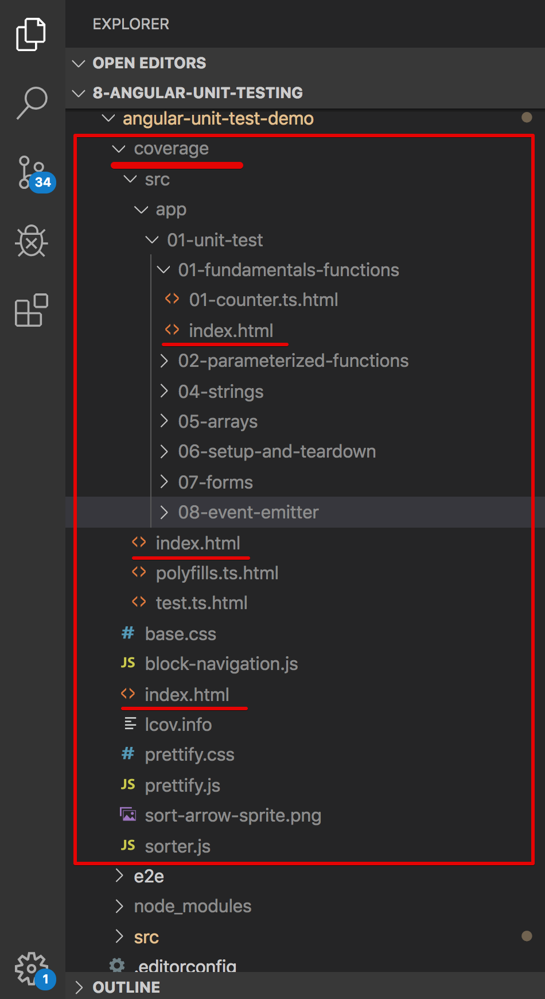
 <figcaption>&nbsp;&nbsp;&nbsp; Image - code coverage - folder structure - vs code </figcaption>
 </figure>
</p>

<hr/>

If you load the `coverage/index.html` from this folder in the browser, we can see the full report:

<p>
 <figure>
 &nbsp;&nbsp;&nbsp; 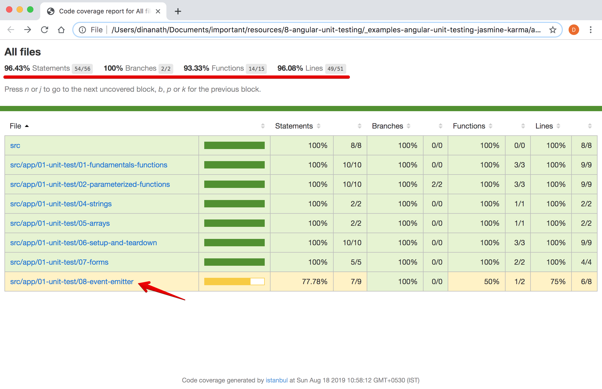
 <figcaption>&nbsp;&nbsp;&nbsp; Image - code coverage - index - full report </figcaption>
 </figure>
</p>

<hr/>

<p>
 <figure>
 &nbsp;&nbsp;&nbsp; 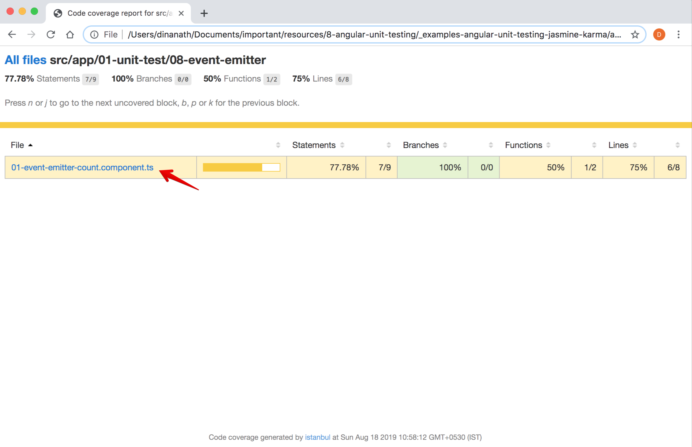
 <figcaption>&nbsp;&nbsp;&nbsp; Image - code coverage - individual component </figcaption>
 </figure>
</p>

<hr/>

<p>
 <figure>
 &nbsp;&nbsp;&nbsp; 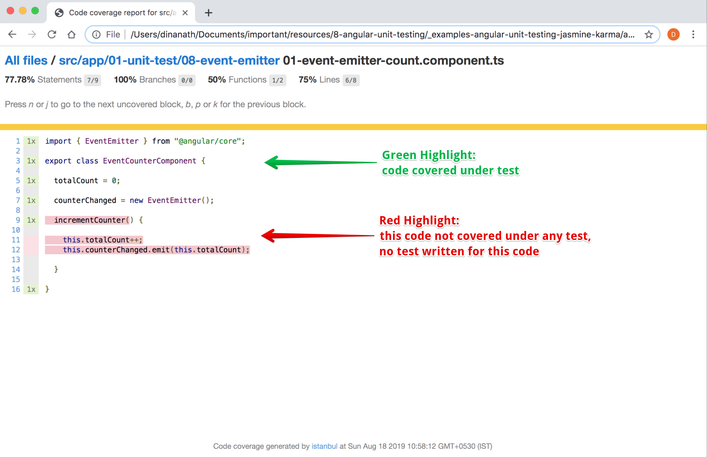
 <figcaption>&nbsp;&nbsp;&nbsp; Image - code coverage - Red Gren Highlight - Whats covered </figcaption>
 </figure>
</p>

<hr/>

> **Note**: 
- To verify code coverage report percentage, one can `comment-uncomment` some code from `.spec` files and view the report
- In code coverage report, `lines marked in GREEN are covered in test` and lines `highlighted in RED are not covered` in the test (no test written for such lines)

8 Working with Integration Testing
=====================

8.1. Integration Test-Setup
---------------------

In a simple isolated unit test, we can create a new component as  `new ComponentName`. But in case of integration test, we need to ask Angular to create an instance of the component with `TestBed` utility. `TestBed` class provides various utility methods to deal with test cases.

> **Syntax & Example**: Basic setup to write integration tests - `name.component.spec.ts`

```typescript
import { TestBed, ComponentFixture } from '@angular/core/testing';

  describe('test-suite-group-name', () => {

    let component: ComponentName;
    let fixture: ComponentFixture<ComponentName>;

    beforeEach( () => {

    // create a dynamic module and put component inside dynamic module
    TestBed.configureTestingModule({
        
      imports: [ Dependency ModuleName, ],
      providers: [ Dependency ServicesName ],
      declarations: [ Current ComponentName, Dependency ComponentName ]

    });

    fixture = TestBed.createComponent(ComponentName);
    component = fixture.componentInstance;
    fixture.detectChanges();

  })

})
```

8.2. Integration Test-Generating setup code
---------------------
8.2. Integration Test-Generating setup code with Angular CLI
---------------------

Creating an integration .spec test file every time manually is pretty time consuming also there are chances of an error. It is advisable to `use Angular CLI to generate components/services/directives/routings, etc.` as Angular CLI generates basic setup code respective to component/test/.spec files.

Angular CLI command to generate component: 
- `ng generate component component-name` OR
- ng g c component-name

(which generates 4 files: `.ts, .html, .css, .spec file` with some basic setup/scaffolding code)

> **Syntax & Example**: Default code in `app.component.spec.ts`

```typescript
import { TestBed, async } from '@angular/core/testing';
import { AppComponent } from './app.component';

describe('AppComponent', () => {
  beforeEach(async(() => {
    TestBed.configureTestingModule({
      declarations: [
        AppComponent
      ],
    }).compileComponents();
  }));

  it('should create the app', async(() => {
    const fixture = TestBed.createComponent(AppComponent);
    const app = fixture.debugElement.componentInstance;
    expect(app).toBeTruthy();
  }));

  it(`should have as title 'app'`, async(() => {
    const fixture = TestBed.createComponent(AppComponent);
    const app = fixture.debugElement.componentInstance;
    // expect(app.title).toEqual('app');
    expect(app.title).toEqual('angular-unit-test-demo!');
  }));

  it('should render title in a h1 tag', async(() => {
    const fixture = TestBed.createComponent(AppComponent);
    fixture.detectChanges();
    const compiled = fixture.debugElement.nativeElement;
    expect(compiled.querySelector('h1').textContent).toContain('Welcome to angular-unit-test-demo!');
  }));
  
});
```

8.3. ATB Angular TestBed
---------------------

### 8.3.1. What is ATB Angular TestBed?

- `TestBed` is the `primary API for writing unit tests` for Angular applications and libraries
- `TestBed` is the basic building block of the angular testing module also the main utility available for Angular-specific testing 
- `TestBed` class provides various utility methods to deal with test cases
- `Configures and initializes environment for unit testing` and provides methods for creating components and services in unit tests
- The Angular Test Bed (ATB) is a `higher level Angular Only testing framework` that allows us to easily test behaviors that depend on the Angular Framework
- Angular TestBed provides slightly easier way/methods/utilities to create components, handle injection, test asynchronous behavior and interact with our application
- With the help of various utilities of as mentioned above, it `makes the writing test cases with Jasmine easier`
- `TestBed.configureTestingModule()` this is where we configure the spec file takes a similar configuration and emulates as `@NgModule`. So, It creates a dynamic testing module and always put this configuration in the `beforeEach()` which runs before every test method
- Test suite's/test file's `beforeEach()` block consists of `TestBed.configureTestingModule()` which give it an object with similar values as a regular `NgModule` for `declarations`, `providers` and `imports`. We can then chain a call to `compileComponents` to tell Angular to compile the declared components
- We can create a component fixture with `TestBed.createComponent()`, Fixtures have access to a `debugElement`, which will give you access to the internals of the component fixture

### 8.3.2. When to Use Angular Test Bed?

We need to use the Angular Test Bed process to perform unit testing of the following things:

- Test Bed allows us to test the interaction of a component or directive with its templates
  - debugElement, nativeElement, triggerEventHandler, classes
- It also allows us to easily test change the detection mechanism of the Angular
  - fixture.detectChanges();
- It also allows us to test the Dependency Injection process 
  - `providers: [ Dependency ServicesName ],`
- It allows us to run tests using NgModule configuration, which we use in our application:

```typescript

TestBed.configureTestingModule({    

  imports: [ Dependency ModuleName, ],
  providers: [ Dependency ServicesName ],
  declarations: [ Current ComponentName, Dependency ComponentName ]

});

```
- It allows us to test user interactions including clicks and input field operation
  - triggerEventHandler

### 8.3.3. Component fixture

We can create a component fixture with `TestBed.createComponent()`, Fixtures have access to a `debugElement`, which will give you access to the internals of the component fixture

Component fixture class is a wrapper around component with this we can: 
- get an instance of the component, 
- get DOM elements via nativeElement or debugElement properties, 
- we can also run change detection manually, and 
- we can also get one or more injected dependencies in this component


8.4. Integration Test-Property binding
---------------------

> **Note: What to test?** 
- All types of bindings: `property binding, class binding, style binding, event binding`
- Property binding: `{{ totalCount }}` or interpolation or some value-class property binding render accurately
- Class binding: some classes like `[class.highlighted]` conditionally applied correctly
- Component object: `Component object initialized`/created properly
- Event binding: Methods like `(click)="upCount()"` invoked flawlessly

> **Syntax & Example**: `02-integration-test/01-property-binding/counter-property-binding.component.html`

```typescript

<div class="counter-container">

    <span class="icon-menu-up count-button" [class.highlighted]="myCount == 1" (click)="upCount()">
        Up Count
    </span>

    <!-- <span class="totalCountText">Total: {{ totalVotes }}</span> -->
    Total:
    <span class="totalCountText">{{ totalCounts }}</span>

    <span class="icon-menu-down count-button" [class.highlighted]="myCount == -1" (click)="downCount()">
        Down Count
    </span>

</div>

```

<hr/>

> **Syntax & Example**: `02-integration-test/01-property-binding/counter-property-binding.component.ts`

```typescript

import { Component, OnInit, Input, Output, EventEmitter } from '@angular/core';

@Component({
  selector: 'app-counter-property-binding',
  templateUrl: './counter-property-binding.component.html',
  styleUrls: ['./counter-property-binding.component.css']
})

export class CounterPropertyBindingComponent implements OnInit {

  constructor() { }

  ngOnInit() {
  }

  @Input() othersCount = 0;
  @Input() myCount = 0;

  @Output() count = new EventEmitter();

  upCount() {
    if (this.myCount == 1)
      return;

    this.myCount++;

    this.count.emit({ myCount: this.myCount });
  }

  downCount() {
    if (this.myCount == -1)
      return;

    this.myCount--;

    this.count.emit({ myCount: this.myCount });
  }

  get totalCounts(): number {
    return this.othersCount + this.myCount;
  }

}

```

<hr/>

> **Syntax & Example**: `02-integration-test/01-property-binding/counter-property-binding.component.spec.ts`

```typescript

import { async, ComponentFixture, TestBed } from '@angular/core/testing';
import { By } from "@angular/platform-browser";

import { CounterPropertyBindingComponent } from './counter-property-binding.component';

describe('CounterPropertyBindingComponent', () => {
  let component: CounterPropertyBindingComponent;
  let fixture: ComponentFixture<CounterPropertyBindingComponent>;

  beforeEach(async(() => {
    TestBed.configureTestingModule({
      declarations: [CounterPropertyBindingComponent]
    })
      .compileComponents();
  }));

  beforeEach(() => {
    fixture = TestBed.createComponent(CounterPropertyBindingComponent);
    component = fixture.componentInstance;
    fixture.detectChanges();
  });

  it('should create CounterPropertyBindingComponent', () => {
    expect(component).toBeTruthy();
  });

  /* binding property - interpolation */
  it('should bind-show-render totalCount', () => {
    component.othersCount = 10
    component.myCount = 5;
    fixture.detectChanges();

    let totalCountTextElement = fixture.debugElement.queryAll(By.css('span'));
    let totalCountTextNativeElement: HTMLElement = totalCountTextElement[1].nativeElement;

    expect(totalCountTextNativeElement.getAttribute('class')).toBe('totalCountText');
    // expect(totalCountTextNativeElement.innerText).toContain(15);

  });

  /* binding style/class */
  it('should highlight the upCount button if totalCounts is 1', () => {
    component.myCount = 1;
    fixture.detectChanges();

    let upCountButtonElement = fixture.debugElement.query(By.css('.icon-menu-up.count-button'));

    expect(upCountButtonElement.classes['highlighted']).toBeTruthy();

  });

  /* binding event */
  it('should increase totalCounts by 1 when upCount button clicked', () => {
    let upCountButtonElement = fixture.debugElement.query(By.css('.icon-menu-up.count-button'));
    
    upCountButtonElement.triggerEventHandler('click', null);
  
    // component.upCount();

    expect(component.totalCounts).toEqual(1);

  });

});

```

8.5. Integration Test-Event binding
---------------------

> **Syntax & Example**: `event-binding.component.spec.ts`

```typescript

/* binding event */
it('should increase totalCounts by 1 when upCount button clicked', () => {
  let upCountButtonElement = fixture.debugElement.query(By.css('.icon-menu-up.count-button'));
  
  upCountButtonElement.triggerEventHandler('click', null);

  // component.upCount();

  expect(component.totalCounts).toEqual(1);

});

```

8.6. fixture detectChanges 
---------------------
8.6. fixture.detectChanges()
---------------------
- In Angular application whenever we make any changes in DOM element, Angular runs its `change Detection` algorithm automatically
- **Note**: In a testing environment, Angular does not run the `change Detection` algorithm automatically so we need to explicitly/manually call it by using `fixture.detectChanges();`
- In a testing environment, Angular doesn't automatically bind the component's properties with the template elements.
    - You have to explicitly call `fixture.detectChanges()` every time you want to `bind a component property with the template`
    - `fixture.detectChanges()` is called to `update the DOM with the new values`
- We use `fixture.detectChanges` to instruct Angular to `run change detection` before doing our assertions with Jasmine’s `expect`
- By using the `ATB = Angular TestBed` and `fixtures` we can inspect the components view through `fixture.debugElement` and also trigger a change detection run by calling `fixture.detectChanges()`
- When we create a component on the TestBed, Angular does not automatically initiate change detection which means that our `template will not be rendered with its bindings evaluated`
    - This simply means that `we need to manually trigger change detection` thankfully our handy `component fixture` makes this easy
    - Whenever we want to trigger change detection, we just need to call `fixture.detectChanges` either at the bottom of our `beforeEach` block or in every test cases

> **Syntax & Example**: `fixture.detectChanges()` 

```typescript

it('should highlight the upCount button if totalCounts is 1', () => {
    component.myCount = 1;
    fixture.detectChanges();

    let upCountButtonElement = fixture.debugElement.query(By.css('count-button'));

    expect(upCountButtonElement.classes['highlighted']).toBeTruthy();

});

it('should have a title Welcome to Angular Testing', () => {
    component.title = 'Welcome to Angular Testing';

    fixture.detectChanges();

    expect(element.textContent).toContain(component.title);

})

```

8.7. Integration Test-Providing dependencies
---------------------

- In case of Unit test, we use to provide dependencies used in constructor as `loginFormComponent = new LoginFormComponent(new FormBuilder);`
- But for the Integration test, we have to use a different approach as `providers`, the same as we used in module.ts/class files
- Any external services used at Component level must be added under .spec/test `providers` (in some cases we need to mention Module level dependencies/services also like HTTP or HttpModule)

> **Syntax & Example**: `Providers in Integration test:` 

```typescript

import { Dependency ServicesName } from './path';

TestBed.configureTestingModule({
    imports: [ Dependency ModuleName, HttpModule ],
    providers: [ Dependency ServicesName, DataService ],
    declarations: [ Current ComponentName, Dependency ComponentName, EmployeeComponents ]
});

```

> **Note**: If dependencies are not provided properly than we get `Error: No provider for service!`. In the case of component, dependencies can be added at either Module level or Component level.


8.8. Testing OnInit ngOnInit
---------------------
8.8. Getting dependencies
---------------------

- In Angular application, `ngOnInit` method is called by Angular automatically at the time of component initialization
- If `implements OnInit` or `export class ComponentName implements OnInit` statement is used than only `ngOnInit()` method executes automatically else `ngOnInit()` is normal method present in class
- When performing testing we need to call `component lifecycle hooks ourselves`, like `ngOnInit()` by ourself as `component.ngOnInit()`, Angular won’t do this for us in the test environment

<!-- ??? -->

If Module level dependencies used in `module.ts` as: `providers: []` than write test case as `it('should load todos from the server', () => { let loginService = TestBed.get(LoginService)})`

> **Syntax & Example**: `module level service dependencies inserted under providers arrays` 

```typescript
@NgModule({
    imports: [ 
        CommonModule
        ],
    providers: [
        LoginService,
        AuthenticationService,
    ]
    declarations: [ LoginComponent ]
})

```

To get dependencies used at component level write test case as `it('should load todos from the component', () => { let loginService = fixture.debugElement.injector.get(LoginService)})`

```typescript
@Component({
  selector: 'login-component',
  templateUrl: './login.component.html',
  styleUrls: ['./login.component.scss'],
  providers: [LoginService, AuthenticationService]

})
```

8.9. Why do we use NO ERRORS SCHEMA
---------------------
8.9. Why do we use NO_ERRORS_SCHEMA 
---------------------

### 8.9.1. What is NO_ERRORS_SCHEMA

Defines a schema that allows any property on any element, so Angular Test ignores any custom elements, attributes in HTML file while testing.

https://medium.com/bb-tutorials-and-thoughts/angular-a-comprehensive-guide-to-unit-testing-with-angular-and-best-practices-e1f9ef752e4e <!-- ??? -->

Let’s run the npm test and we would see a bunch of errors because of nesting components. since the app component has other components inside such as header, footer, and add-item.component, etc.. We have to declare those in the app.component.spec.ts file `TestBed.configureTestingModule()` blocks `declarations` array

Another way is to use `NO_ERRORS_SCHEMA` which tell angular `“Angular, please ignore all the unrecognized tags while testing app.component”`

> **Syntax & Example**: `schemas: [ NO_ERRORS_SCHEMA ]` 

```typescript
import { NO_ERRORS_SCHEMA } from '@angular/core';

beforeEach(async(() => {

  TestBed.configureTestingModule({

    declarations: [ ComponentName ],

    schemas: [ NO_ERRORS_SCHEMA ]

  }).compileComponents();

}));

```

### 8.9.2. Why you shouldn’t use NO_ERRORS_SCHEMA in Angular Unit Tests

`NO_ERRORS_SCHEMA` simply telling the TestBed to ignore any template errors. 
So, while testing when it hits `<header-component>` tag, you don’t have to import `HeaderComponent` into your TestBed in your spec file. Angular will just treat that tag like any old div and continue on its way. In the above example, you don’t need to import any of the child components as well as custom components of ParentComponent.

However, there’s a big gotcha! and thing to understand for everyone is that: it also will `ignore unknown attributes; both property bindings and event handlers`. Here is an example:

```typescript

<footer [checking]="testing" (customClicked)="onClick($event)"> </footer>

```

Now let us discuss the problem - The bindings in FooterComponent are to `[checking]` and (customClicked) not `click`. But the `unit tests will still compile! They’ll even run!`. 

`ng build --prod` will catch the property binding problem, `[checking]`, but will not catch the misnamed (customClicked) handler. The only way to find that one is in integration testing! so overpowering `NO_ERRORS_SCHEMA` could be causing damage.
